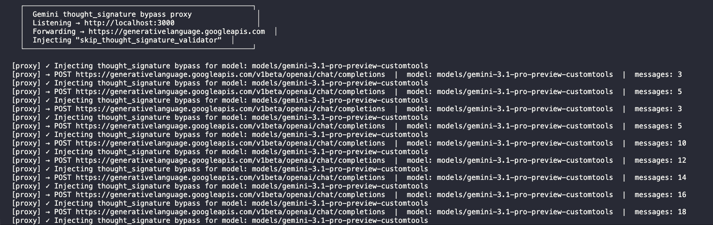

# Gemini Thought Signature Proxy

```
400 INVALID_ARGUMENT: Function call is missing a thought_signature in functionCall parts.
```



## What this is and why I built it (The Simple Version)

I wanted to use the new **Gemini 3.1 Pro Preview** model directly inside **VS Code Insiders** using GitHub Copilot's new "Bring Your Own Key" (BYOK) feature.

I set it up using the "OpenAI Compatible" (customoai) vendor option. It worked great for normal chatting. But the moment I tried to use **Agent mode** (where the AI can actually run tools, read files, and do things), it broke immediately with the `thought_signature` 400 error above.

**Why?** Gemini 3.1 does a "thinking" step before it uses a tool. Google attaches a special cryptographic signature to that thought. When VS Code replies back to Google, Google expects to see that signature again. But VS Code is built for OpenAI, not Google, so it just deletes that signature because it doesn't recognize it. Google sees the missing signature and throws a 400 error.

**The Fix:** This package is a tiny local proxy server. It sits between VS Code and Google. Right before VS Code sends a message to Google, this proxy sneaks in and injects a special "bypass code" (`skip_thought_signature_validator`) that Google officially allows. This tricks Google into accepting the request without the signature.

## Quick Start

### 1. Run the proxy locally

Open your terminal and run:

```bash
npx gemini-thought-signature-proxy
```

_(When it starts, it will print out a `curl` command you can use to test that it's working. We do not store or log your API key!)_

### 2. Configure VS Code Insiders

You need to edit your `chatLanguageModels.json` file.

**How to find it:**

- Press `Cmd+Shift+P` (or `Ctrl+Shift+P` on Windows/Linux)
- Search for **`Chat: Open Language Models (JSON)`**
- Or find it directly at `~/Library/Application Support/Code - Insiders/User/chatLanguageModels.json` on macOS.

Make sure your file looks like this (pointing to `localhost:3000` instead of Google):

```json
[
  {
    "name": "OpenAI Compatible",
    "vendor": "customoai",
    "apiKey": "",
    "models": [
      {
        "id": "models/gemini-3.1-pro-preview-customtools",
        "name": "Gemini 3.1 Pro Preview Custom Tools",
        "url": "http://localhost:3000/v1beta/openai/",
        "toolCalling": true,
        "vision": true,
        "maxInputTokens": 1000000,
        "maxOutputTokens": 66000
      }
    ]
  }
]
```

### 3. Add your API Key in VS Code

Just putting it in the JSON file isn't enough! You have to tell VS Code what your actual Google Gemini API key is.

1. Open the Command Palette (`Cmd+Shift+P`).
2. Search for and select **`Chat: Manage Language Models`**.
3. You should see the model you just added (`Gemini 3.1 Pro Preview Custom Tools`). Click on it.
4. If it asks for a name, just hit Enter.
5. An input box will appear asking for the API key. **Paste your Google Gemini API key here and hit Enter.**

That's it! You can now use Gemini 3.1 Pro in Agent mode without the 400 error.

---

## Technical Details

### The Failure Flow

1. VS Code → Google (round 1, signature returned)
2. VS Code strips signature
3. VS Code → Google (round 2, 400 error)

### How it works under the hood

Before forwarding any request, the proxy walks the `messages` array, finds every `role: "assistant"` message with `tool_calls`, and injects a stateless bypass sentinel:

```json
"extra_content": { "google": { "thought_signature": "skip_thought_signature_validator" } }
```

### Path routing note

VS Code constructs the final URL by appending `v1/chat/completions` to the base URL in `chatLanguageModels.json`. With a base of `http://localhost:3000/v1beta/openai/`, VS Code sends requests to `/v1beta/openai/v1/chat/completions`. The Google endpoint is `/v1beta/openai/chat/completions` (no extra `/v1`). The proxy intercepts VS Code's path and rewrites the upstream target accordingly.

### Note on Models

The bypass only activates for `models/gemini-3.1-pro-preview-customtools`. Other models pass through untouched.

### When this might stop working

If Google changes enforcement post-GA, the `PATCHED_MODEL_ID` and `BYPASS_SIGNATURE` constants may need to be updated.

### References

- [Google's official thought signatures docs](https://ai.google.dev/gemini-api/docs/thought-signatures)
